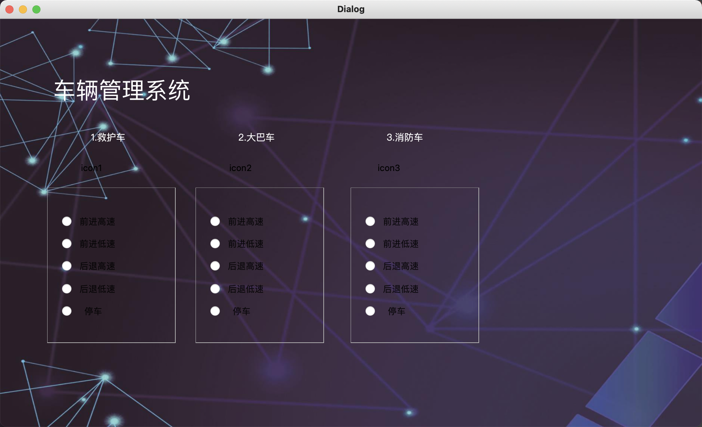

# 安装依赖
```python
python3 -m pip install -r requirements.txt
```

# 运行项目
```python
python3 main.py
```

# 项目截图
主界面：


控制页面：



监控页面：


# 项目结构
## 主要文件

主目录下：main.py car_control.py car_view.py

UI目录下：UI_main.py UI_carControl.py UI_carView.py

上述py文件一一对应，在UI文件夹下的代码主要是页面的设计代码，不涉及逻辑，主目录下的py文件是对页面UI的逻辑处理
## 其他文件
pictures目录：页面展示图片

source目录：资源图片，标签背景图等存放位置

utils文件夹：一些功能函数存放位置

Socket_server.py：服务端发送socket的示例代码


